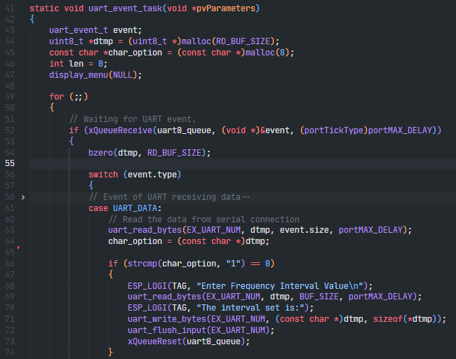
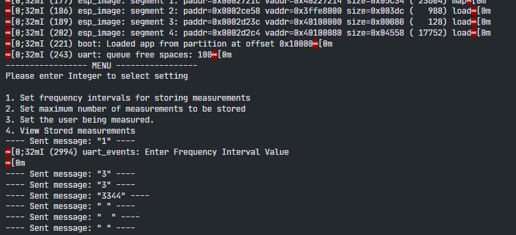

# Pulse Rate and SPO2 Measurement on ESP8266

## ESP8266 Pinout Diagram

- There are 4 configurable GPIO pins
  - GPIO 0
  - GPIO 2
  - GPIO 1 (TX)
  - GPIO 3 (RX)

## Resources

- [How to design a better Pulse Oximeter](https://www.analog.com/en/technical-articles/how-to-design-a-better-pulse-oximeter.html)

- [DIY Pulse Oximeter](https://www.instructables.com/DIY-Pulse-Oximeter/)

- [How to Design a better Pulse Oximeter: Specification](https://www.embedded.com/how-to-design-a-better-pulse-oximeter-specifications/)

- [How to design a better pulse oximeter: Implementation](https://www.embedded.com/how-to-design-a-better-pulse-oximeter-implementation/)

- [Design and Fabrication of a Pulse Oximeter](https://www.researchgate.net/publication/335058012_Design_and_Fabrication_of_a_Pulse_Oximeter)

- [Pulse Oximeter](https://www.researchgate.net/publication/278730850_Design_and_implementation_of_a_Pulse_Oximeter)

## System Requirements

1. The system should have two modes/states:

   - Measurement

   - Reporting

1. Measurement Mode Requirements:

   1. The system should measure a pulse rate (PR) between the range of 60 bpm - 100 bpm. ([Source 1 for Elderly Person](https://www.healthtap.com/q/normal-pulse-rate-elderly/)) ([Source 2 for Elderly Person BPM](https://healthfully.com/normal-pulse-rate-senior-citizens-5454202.html))

      - The system should have a fixed time for switching on and off the LED and Infrared Light.

      - The system should read both the AC and DC signals from LED driving circuit

      - The system should use a timer for a counter to count the number of ticks.

      - The system should calculate the bpm based on the number of ticks counted.

   1. The system should estimate the user's oxygen saturation level as a percentage(95% and above). ([Oxygen Saturation](https://www.ncbi.nlm.nih.gov/books/NBK525974/)) ([Elderly Person Oxygen Saturation](https://www.griswoldhomecare.com/blog/2021/august/oxygen-levels-in-elderly-adults-when-to-be-conce/))

   1. The system should transmit the measurement reading to serial terminal once reading is complete.

   1. The system should trigger the buzzer if measurement reading is hazardous to elderly persons

      - The buzzer should trigger if pulse rate is below 60 bpm.

      - The buzzer should trigger if oxygen saturation level is below 95 %

1. Reporting Mode Requirements:

   1. The system should allow the user to view previous (stored) measurements.

   1. The system should allow input from user via serial interface (UART).

      - The system should allow input from user to set the intervals at which measurements are stored.

      - The system should allow input from user to set the maximum number of measurements stored.

      - The system should allow input from user to set the storage format of the measurement data.

1. General Requirements:

   1. The system should store measurements in non-volatile memory.

   1. The system should be able to switch between measurement and reporting mode.

   1. The system should operate on a 9V battery.

   1. The system should allow the user to turn off the system without losing measurement readings.

   1. The system should be designed for a maximum power consumption of 100mA at any point in time.

   1. The system should be able to produce a precise measurement of the pulse rate using an accuracy of ± 5%.

## Logs 
[17/11/2022] 

- Started Repository for Project
- Created Components folder containing the The Measurement and Reporting Modules
   - The Measurement module contains the code to interface with the LED driving circuit and I2C connection for the ADS11155.
   - The reporting module contains the code to interface with the UART and Flash storage.
   - The main module contains the code for utilizing functions created in the reporting and measurement modules for integrating these functions for the operation of the system.

[18/11/2022]
- Used the "uart_events" example for testing the functionality of the uart drivers.

- Added custom code for project specific UART functionality

- Encountered problem with custom code. No compilation errors, nor runtime error being thrown in the program, however, the program does not function as it should. 
   
   - The code snippet below is my modified code for the implementation of my UART task function.
   
   - 
   
   - The image below showcase the output of the program that was flashed which contained the above code snippet.

   - 

   - Based on the output image, I am able to confirm the triggering of the uart_read_bytes function on line 63. Additionally, the if condition statement is also triggered as the first sent message correctly produces the desired output on the serial terminal from line 68. However, the uart_read_byte function on line 69 and consequently the remaining lines of code do not trigger.
    I have sent messages as shown in the program output but the code is not triggering the remaining function calls. I have tried resetting the serial queue to its empty state and resetting the UART input as shown in lines 72 and 73, but this does not resolve my problem. 
   As previously mentioned, there were no compilation errors and no runtime errors occurred during the program execution.

[19/11/2022]

- Used the "storage/spiffs" example for testing the functionality of the storage capability of the ESP8266 device.

- Created the filesystem that will be used for the program application.

- Encountered a problem building the code for project as an build error with the message of "Unable to locate spiffs component" was thrown when using the "make app" command, however, upon research, the solution of this problem was specifying the name of the component in the project module's CMakeLists.txt file.

[20/11/2022]
